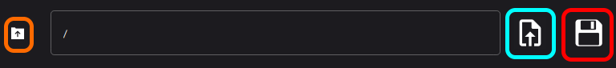
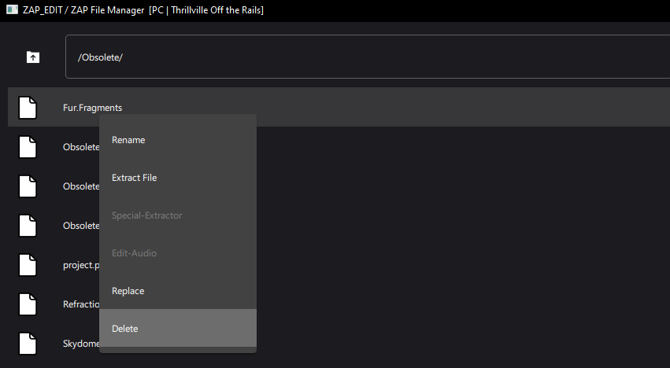
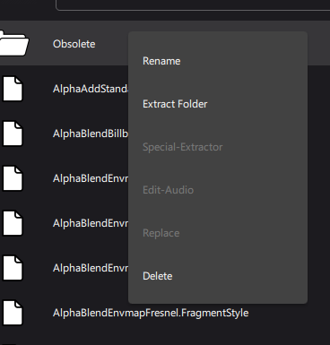
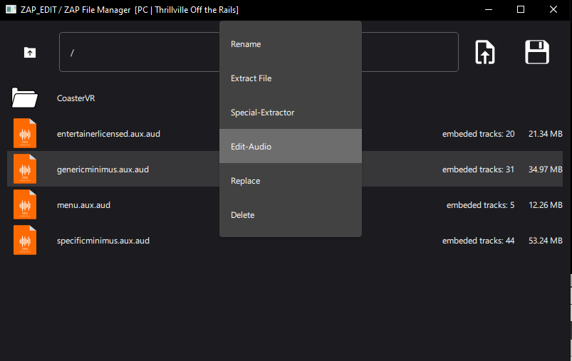
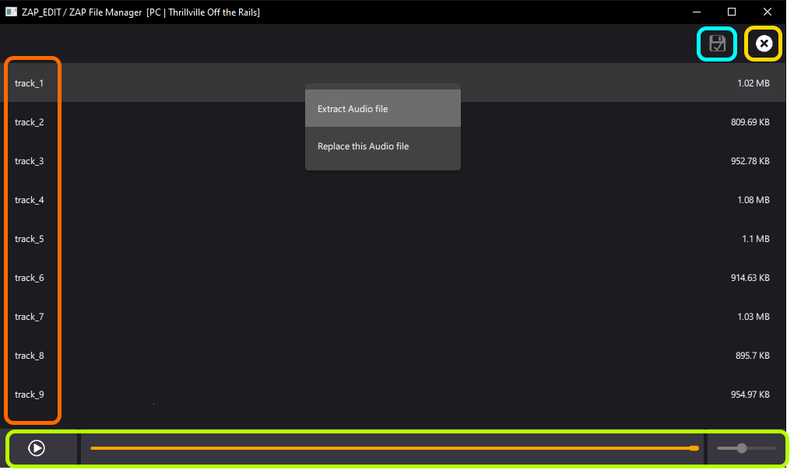

## ZAP_Edit

Edit .Zap files of the game "thrillville: off the rails". 

This tool enables you to edit or extract ZAP files.
Make sure that you make a backup of the files that you want to edit.

# USAGE

Open a ZAP file with the icon 

  
  
Open a ZAP File

  
Save the changes as new ZAP file

  
Go to parent folder

## How to change anything

This tool is like a file explorer but with some special functions. Basic functionalities like Replace, Delete or rename are supported. 

If you want to add a new file, just drag and drop it in here. (You cannot drag and drop folders)

Folders have a similar context-menu:

Sometimes Audio/OGG files are embedded in the ZAP file. These (Orange Highlighted) files can be extracted (with the Special-Extractor) OR edited in a dedicated GUI screen by clicking Edit-Audio.

# Audio Editing

  
  
Here are the embedded tracks, double left click on a track-row to play it

  
  
Click here to apply changes

  
  
Your typical audio player

  
  
Leave the Audio-Editor. Throws away unsaved audio.

## What type must my audio have to work?
It must be an OGG File.

Make sure that your replacement audio file has similar characteristics to the file that you will replace. 
Depending on the situation the length can be 
relevant.

### Examples:
Entertainer audio:

- Channels: Stereo
- Sampling Rate: 44100 Hz <-- This is very important
- Bits per Sample: 32
- Bitrate: 80 kB/s

Park intro voice:
- Channels: Stereo
- Sampling Rate: 22050 Hz <-- This is very important
- Bits per Sample: 32
- Bitrate: 30 kB/s

Park Radio:
- Channels: Stereo
- Sampling Rate: 32000 Hz <-- This is very important
- Bits per Sample: 32
- Bitrate: 70 kB/s

I think the bitrate of the ogg file can be higher. 

## Limitations
- Only Thrillville off the rails [PC] is supported
- Currently you cannot create new folders in the zap file

# Credits
I wanted to merge my Zap editor with an audio editing tool and include a user interface. I was inspired to create this program by the following tool:
https://github.com/ralf2oo2/ThrillEdit

This was made with the QtFramework Version 6.5
https://www.qt.io/download-open-source
